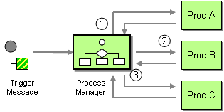

## Process Managers for KafkaFlow

The main purpose of a [process manager](https://www.enterpriseintegrationpatterns.com/patterns/messaging/ProcessManager.html)
is to encapsulate the process specific logic
and maintain a central point of control. It’s initiated by a trigger message which
could be an event coming out of a bounded context.

**NOTE**:

> It's important to note that the process manager does not perform any business logic.
> It only routes messages, and in some cases translates between message types.

Microsoft also [echoes that](https://learn.microsoft.com/en-us/previous-versions/msp-n-p/jj591569(v=pandp.10)#when-should-i-not-use-a-process-manager):

> You should not use a process manager to implement any business logic in your domain.
> Business logic belongs in the aggregate types.

Typically process managers are using _events_ as inputs, maintain an internal state
and produce _commands_ as outputs.

### Process Managers Essentials

The following things are essential for process managers:

- Process managers are _stateful_ actors.
- They are _strictly consistent_ with their owned state.
- Publishing commands is _strictly consistent_ with state changes.

The above means that process managers' state cannot be a simple eventually consistent
projection. Process managers either update the state **and** send messages, or do **none** of that.

The requirement of being transactionally consistent between the state and published messages
implies using the [Transactional Outbox](https://microservices.io/patterns/data/transactional-outbox.html) pattern.

